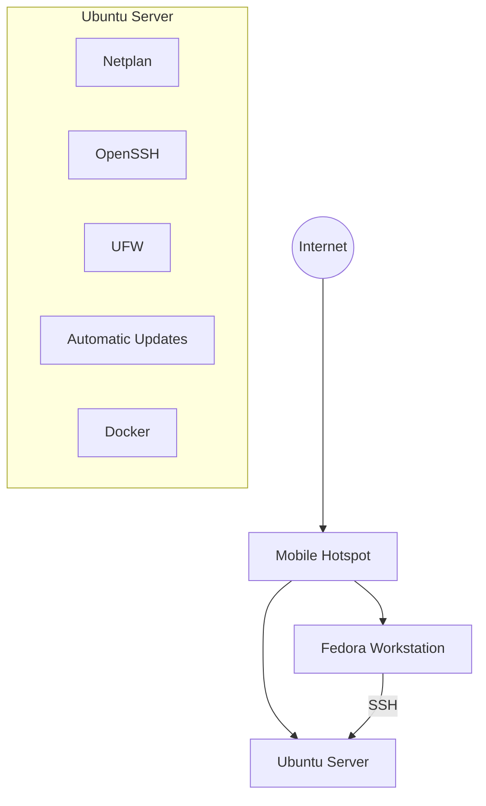

````markdown
# Current Architecture


```mermaid
flowchart TB
    Internet((Internet))
    Hotspot[Mobile Hotspot]
    Fedora[Fedora Workstation]
    Ubuntu[Ubuntu Server]

    Internet --> Hotspot
    Hotspot --> Fedora
    Hotspot --> Ubuntu

    Fedora -- SSH --> Ubuntu

    subgraph Ubuntu Server
        Netplan
        OpenSSH
        UFW
        AutoUpdates[Automatic Updates]
        Docker
    end
```
````
